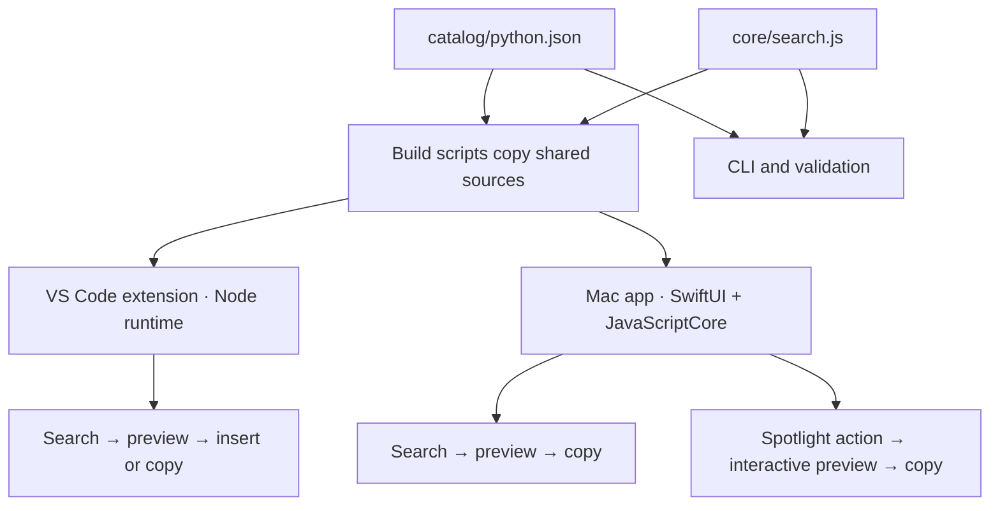

# SnippetHub architecture

Updated against the repository on 2026-09-23. This describes the implemented MVP; future scope lives in [ROADMAP.md](ROADMAP.md). Design rationale lives in [DECISIONS.md](DECISIONS.md).

## System shape

SnippetHub has two local interfaces over one catalog and search engine. There is no server, database service, model, runtime network access, or synchronization layer.



Each runtime creates its own in-memory index from its bundled catalog. There is no cross-process search service. Changes to source files reach installed apps only after rebuilding and replacing their artifacts.

## Components and ownership

| Source | Responsibility |
| --- | --- |
| [catalog/python.json](catalog/python.json) | Single source of recipe content, search metadata, and Python dependencies. |
| [core/search.js](core/search.js) | Catalog validation, token normalization, index construction, candidate retrieval, and ranking. Exposes `SearchEngine` and `validateCatalog`. |
| [apps/vscode/extension.js](apps/vscode/extension.js) | VS Code command, Quick Pick, preview, clipboard, and editor insertion. |
| [apps/mac/SnippetHub.swift](apps/mac/SnippetHub.swift) | SwiftUI window, selection state, and clipboard access. |
| [apps/mac/SnippetStore.swift](apps/mac/SnippetStore.swift) | Main-actor JavaScriptCore bridge shared by the window and App Intents. |
| [apps/mac/SpotlightIntents.swift](apps/mac/SpotlightIntents.swift) | Background search action, interactive Spotlight preview, pagination, and deliberate copy. |
| [scripts/](scripts/) and [tests/](tests/) | Builds, command-line search, catalog checks, benchmarks, and regression tests. |

The core uses a small universal module wrapper: CommonJS exports in Node, or a global `SnippetHub` object in JavaScriptCore. It has no third-party runtime dependencies.

## Catalog contract

The storage format is one JSON array, currently with 10 Python objects. There is no persisted index or schema-version field. The implementation of `validateCatalog` is the current validation contract.

| Field | Current constraint / use |
| --- | --- |
| `id` | Unique, nonempty lowercase kebab-case identifier. Stable identity and ranking tie-breaker. |
| `language` | Must equal `python`. |
| `title`, `description`, `category` | Nonempty strings; displayed by the interfaces and indexed. |
| `tags`, `aliases` | Nonempty arrays of nonempty strings; aliases encode common ways to ask for the recipe. |
| `dependencies` | Array of nonempty package-name strings, or `[]` for the standard library. Display metadata, not installed automatically. |
| `code` | Nonempty string of literal Python source. A trailing newline and self-contained examples are contribution conventions. |

The validator checks structure and uniqueness, not Python execution, dependency availability, or example correctness. `npm run validate` additionally parses each recipe with Python's `ast.parse`. It does not import pandas or run file operations.

Swift decodes the fields needed for display (`id`, `title`, `description`, `category`, `code`, `tags`, `dependencies`); other catalog metadata remains available to the shared JavaScript search engine. Adding a field does not automatically expose it in either interface.

## Search lifecycle

### Index construction

The engine validates the catalog, keeps a shallow copy of the array, and builds four structures. Callers treat catalog objects as immutable.

| Structure | Contents |
| --- | --- |
| `postings` | Normalized term → map of catalog array position → accumulated field weight. |
| `prefixes` | Prefix of at least two characters → set of canonical terms. |
| `typos` | Original spelling or one-character deletion → candidate vocabulary spellings, for words of at least four characters. |
| `phrases` | Normalized title and alias strings for each snippet. |

Normalization folds diacritics to plain ASCII letters, removes apostrophes, lowercases text, combines “data frame” into “dataframe”, extracts ASCII alphanumeric tokens, removes filler words, and applies curated synonym groups, including `pd` → `pandas` and `np` → `numpy`. Synonym spellings also feed the prefix and typo indexes when their canonical term occurs in the catalog. Shorthand does not add content: the launch catalog has pandas recipes but no NumPy recipes.

Field weights are title **6**, tags **5**, aliases **4**, description **2**, and category **2**. A term contributes once per field, with weights accumulated across fields. All aliases are joined into one indexed field. Code and dependency names are not indexed as fields.

### Query evaluation

1. Convert the query to text, take the first 256 characters, normalize it, and retain at most 24 distinct meaningful terms. A blank query returns recipes in catalog order; a nonblank query containing only filler or punctuation returns no results.
2. Resolve each term through exact, prefix, and typo indexes. Match-quality multipliers are **1**, **0.7**, and **0.55**, respectively. Typo candidates must pass a one-edit check covering insertion, deletion, substitution, or adjacent transposition. Normalized query terms need at least three characters, and indexed typo targets need at least four, so `JON` can match `JSON` without fuzzy matching arbitrary one- or two-character input. Recognized shorthand is canonicalized before matching.
3. Visit matching postings and keep the strongest alternative per query term and snippet. This prevents several synonym or prefix candidates from inflating the same term's score.
4. Require at least **60% query-term coverage**, apply coverage and phrase boosts, sort by descending score with ID as the tie-breaker, and apply the result limit.

For a matched vocabulary term, the contribution is:

```text
quality × log(1 + catalogSize / postingSize) × fieldWeight / (fieldWeight + 6)

coverage = matchedQueryTerms / distinctQueryTerms
finalScore = sum(bestContributionPerQueryTerm) × coverage² + phraseBonus
phraseBonus = 3 when the normalized query equals a stored title or alias; otherwise 0
```

The query is deduplicated before phrase comparison, while stored phrases preserve repeated normalized terms. This is a custom lexical score, not a full BM25 implementation or a semantic model. It does not interpret arbitrary paraphrases, negation, or non-ASCII language tokens.

The public call is `engine.search(query, limit = 20)`, returning `{ snippet, score, matchedTerms }` objects. A limit that is not a number, is `NaN`, or is below 1 returns no results; `Infinity` means every match, and other limits are floored and capped at the catalog size. VS Code uses the default 20-result limit, Mac requests 50, and the CLI requests 5.

### Cost and scaling

Index construction happens once per engine instance, not on every keystroke. Retrieval visits candidate vocabulary entries and their postings rather than scanning every code body. Broad terms can still match most of the catalog, and sorting costs grow with the number of candidates. Prefix and deletion indexes trade additional startup memory for lookup speed.

`npm run bench` measures index creation and warm searches for 10, 1,000, and 10,000 entries. Larger sets repeat launch recipes with unique IDs. Results characterize synthetic posting-list load, not catalog diversity, end-to-end UI latency, cold-start performance, or memory consumption. There is no enforced performance threshold in CI.

## VS Code flow

Activation creates an engine and registers `snippethub.search`. Opening the picker captures the active editor, selections, and document version before focus changes. Each input change searches synchronously, replaces the result items, and activates the first result.

Items use `alwaysShow`, description/detail matching is disabled, and `sortByLabel` is disabled so the shared engine controls results. Preview opens an unsaved Python document beside the target with focus preserved; copy writes literal code to the clipboard.

Acceptance is guarded against duplicate events. If there was no original editor, it opens a new unsaved Python document. Otherwise, a closed or changed document is rejected. `SnippetString.appendText` escapes snippet syntax, and `insertSnippet` applies the code to the original selections. Hiding the picker disposes its event handlers and UI resources.

The extension can insert into the active text editor regardless of language. The catalog and preview documents are Python-specific. No autocomplete provider is registered.

## Mac flow

`SnippetStore`, an `@MainActor` service, reads bundled JavaScript and JSON, constructs a `JSContext`, and creates the shared engine once per process. A cached `Result` propagates initialization errors to either interface. The window’s observable `Library` owns only UI state and calls that store. Searches call a JavaScript function with the query as an argument; user text is not interpolated into executable JavaScript. Results are serialized to JSON and decoded into Swift display models.

Query changes search synchronously on the main actor. Selection is retained if it remains in the results; otherwise the first result is selected. SwiftUI provides the search field, result list, code preview, empty/error states, and keyboard navigation. Copy uses `NSPasteboard` with a brief confirmation state. The app does not directly insert into another application's editor.

The app currently uses a normal window and a dark presentation. There is no global hotkey, menu-bar launcher, user catalog editor, or persistent preference store.

### Spotlight flow (macOS 26+)

`SnippetHubShortcuts` exposes `SearchSnippetsIntent` as **Search SnippetHub**. Its required string parameter appears in its parameter summary so Spotlight can collect it inline. The action runs in the background, calls `SnippetStore`, returns the first match’s literal code to Shortcuts (or `No results found`), and returns `SnippetPreviewIntent` for an interactive result view. All new intents are availability-gated; the normal window retains its macOS 14 deployment target.

The preview carries a query, result position, and copied recipe ID. It reloads bundled results when rendered, clamps out-of-range positions, and displays one complete recipe with its description and dependencies, or an empty state. Previous/Next buttons invoke a private browsing intent; Copy invokes a private intent that resolves a stable catalog ID before writing literal code to `NSPasteboard`. A successful write returns the preview with a Copied label. No query automatically changes the clipboard. App Intents may render in another process, so the preview does not depend on the window’s selection or mutable UI state.

This is submitted action search, not a custom Spotlight search provider or Core Spotlight catalog index. The OS owns result ordering and keyboard routing. Select the search action before pressing Tab; selecting the app-launcher row is a different OS operation. No retrieval logic was added to Swift, and no code is executed.

## Builds and verification boundaries

| Command / configuration | Result |
| --- | --- |
| `npm run build:vscode` | Copies shared sources, extension files, README, CONTRIBUTING, and LICENSE into `dist/vscode`. F5 loads this directory. |
| `npm run package:vscode` | Uses pinned `@vscode/vsce@3.9.2` to produce `dist/snippethub-<version>.vsix`, named from the extension manifest; first use may download tooling. |
| `npm run build:mac` | Uses Xcode 26+ to compile Swift for the current architecture and macOS 14+ deployment. Extracts App Intents constant metadata into the bundle’s `Resources/Metadata.appintents` before signing `dist/SnippetHub.app`. `SNIPPETHUB_SIGN_IDENTITY` selects an existing certificate; omission uses ad-hoc signing for window-only development. A Swift compilation alone does not make actions discoverable. |
| `npm run test:mac` | Rebuilds, checks extracted action/shortcut metadata and signature, compares real JavaScriptCore ranking/code to Node fixtures, checks bad resources, and exercises intent output/preview bounds on macOS 26+. It does not verify OS discovery or rendered Spotlight UI. |
| `npm test` | Node tests for retrieval and a mocked VS Code adapter. The Node VM test checks the non-CommonJS export path, not the real JavaScriptCore runtime. |
| [.github/workflows/ci.yml](.github/workflows/ci.yml) | Linux runs tests, catalog validation, and the extension development build; a macOS 26 runner supplies the Xcode 26+ toolchain that `test:mac` needs. It does not publish or run UI tests. |

`dist/` is generated and ignored by Git. Development requires Node.js 22+, Python 3 for catalog validation, and Xcode 26+ with the macOS 26+ SDK for the Mac build. Pandas belongs to the user's Python environment when running relevant recipes, not the app runtime.

Live editor behavior, clipboard interactions, and Mac UI usability require the manual checks in [CONTRIBUTING.md](CONTRIBUTING.md). Repository scripts do not establish Marketplace publication, Developer ID signing, or notarization.

### System execution verification (2026-09-22)

On the macOS 27 development host, Shortcuts discovered **Search SnippetHub** from the installed bundle but could not communicate with the ad-hoc-signed app. App Intents logs reported a missing team identity and `LNConnectionErrorDomain` code 1200. Rebuilding with an existing Apple Development identity and replacing the stopped installed app fixed the connection: system logs showed both search and preview intent execution completing. No signing credentials or personal identity are committed to the repository.

The normal app's search, navigation, copy confirmation, and empty state were checked through its live UI. Spotlight itself could not be opened by the desktop-control service, and the separately hosted Shortcuts result view was inaccessible to that service. Interactive preview layout, pagination, clipboard behavior in that preview, and Spotlight keyboard routing still require the manual checklist. Discovery and system execution are stronger evidence than direct smoke tests, but do not establish those visual checks.
